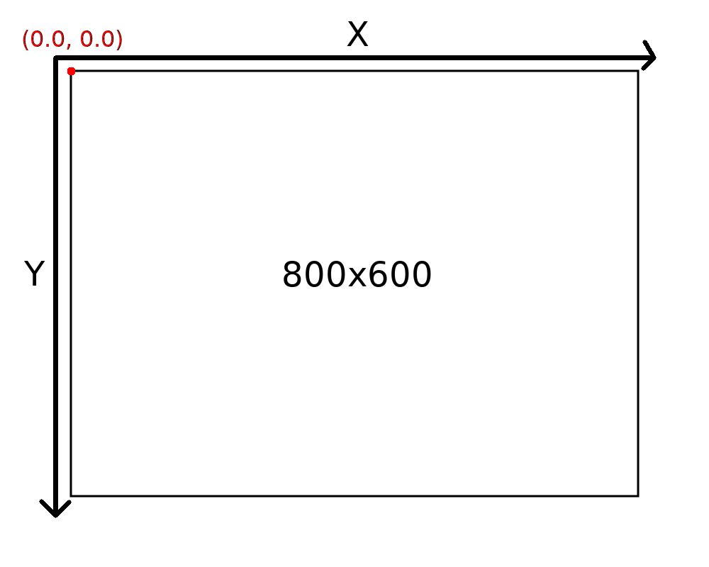

# Configurando a matriz de visão e projeção

Para desenhar nossa cena, é necessário que a placa de vídeo saiba para onde nossa câmera está apontada, e qual é o tamanho e o tipo da área de visualização a ser desenhada. Este pode ser um tópico complexo, por isso, apenas determinaremos alguns padrões fixos.

Criaremos uma cena com um tamanho exato de 800x600, como o tamanho da nossa janela. Os valores da coordenada X crescerão da ESQUERDA para a DIREITA; os valores da coordenada Y, contra-intuitivamente (porém, como normalmente empregado em engines de jogos 2D), crescerão de CIMA para BAIXO. Além disso, a origem (coordenada {0, 0} do plano) ficará no canto superior esquerdo da tela. Como na figura a seguir:



Abra o arquivo `src/MinhaCena.cpp`. No método `void MinhaCena::init`, insira o seguinte código:

```cpp
    glm::mat4 view =
        glm::lookAt(
            glm::vec3(0.0f, 0.0f, -1.2f),
            glm::vec3(0.0f, 0.0f, 0.0f),
            glm::vec3(0.0f, -1.0f, 0.0f));

    glm::mat4 projection =
        glm::ortho(
            0.0f,
            800.0f, -600.0f,
            0.0f, 1.0f, 10.0f);

    mvp = projection * view;
```

Para uma rápida explicação, definimos separadamente, a princípio, duas matrizes.

A primeira é a matriz `view`. Através desta matriz, definimos o lado para o qual a câmera "olha".
Ela assume que estamos usando uma representação cartesiana clássica do OpenGL, e não a representação cartesiana que estabelecemos no desenho anterior; esta representação possui a origem no centro exato da tela, e o eixo X cresce normalmente para a esquerda, mas o eixo Y cresce para CIMA e ambos os eixos têm as suas extremidades da tela entre -1.0 e 1.0 (diferente da nossa projeção, que terá as extremidades entre 0 e 800 em X, e entre 0 e 600 em Y (Caso você não tenha entendido muito bem esta projeção padrão do OpenGL, ignore-a por enquanto).
A função `glm::lookAt` recebe três vetores de 3 coordenadas (X, Y, Z) como argumento:

- O primeiro vetor é a posição onde a câmera/o olho está (no caso, 1.2 unidades na direção contrária à tela, a partir do centro dela);
- O segundo vetor é a localização do centro da tela (no caso, a origem do plano);
- O terceiro vetor é o vetor que aponta PARA QUAL LADO fica a direção "para cima". No nosso caso, como queremos que nossas coordenadas Y cresçam PARA BAIXO, passamos um vetor que tem o valor Y definido como -1 (direção invertida em Y).

A segunda é a matriz `projection`, que efetivamente determina o formato da nossa tela.
Esta matriz é definida pela função `glm::ortho`, que cria uma projeção ortogonal (quadrada, diferente de uma projeção de perspectiva). Recebe seis argumentos:

- `left`, `right`, `bottom` e `top`: Especificamente as posições de cada um dos limites da nossa tela, de acordo com seus respectivos nomes;
- `near`, `far`: Especificamente os limites de desenho no plano Z. No nosso caso, quaisquer objetos desenhados com uma coordenada Z menor que 1.0 e maior que 10.0 seriam ignorados ou cortados por estes planos.

Por fim, multiplicamos estas duas matrizes na ordem correta, e damos o resultado desta multiplicação à matriz `mvp` da nossa cena.
