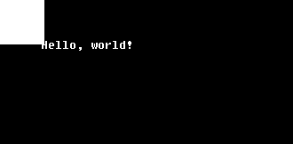
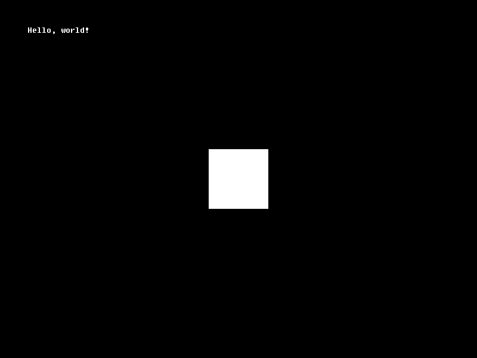

# Renderizando um ofPrimitive

Nós já sabemos que nossa entidade está em nossa cena, mas não temos NENHUMA representação visual de que ela ao menos exista!

É hora de usar um dos recursos da OficinaFramework: usaremos uma primitiva, ou `ofPrimitive`, para desenhar uma forma simples na tela que possamos manipular a nosso gosto.

`ofPrimitive`s são objetos que guardam informações de desenhos com vértices simples e sequenciais, derivados das primitivas de OpenGL. Estas informações são carregadas, no momento da criação, para a sua própria GPU e lá ficam armazenadas para desenho estático, o que significa que você, enquanto um desenvolvedor preocupado com a performance do seu jogo, não precisa se preocupar com a quantidade de informações que são enviadas a cada quadro para a sua GPU!

## Desenhando a primitiva

Vamos começar indo ao arquivo `src/MinhaEntidade.hpp`.

Precisaremos das definições de renderização para desenhar na tela, portanto, abaixo da inclusão do cabeçalho `oficina2/entity.hpp`, inclua o cabeçalho de renderização:

```cpp
#include <oficina2/render.hpp>
```

Agora, entre a linha onde está escrito `private:` e a linha onde está escrito `public:`, adicione o seguinte campo:

```cpp
    ofPrimitive* pQuadrado;
```

Agora, mude para o arquivo `src/MinhaEntidade.cpp`. Vamos inicializar a forma da nossa primitiva.

Vá para o método `void MinhaEntidade::load`. Lá, digite o seguinte código, ANTES da nossa mensagem de log:

```cpp
    float vertices[] = { // Vértices do quadrado
        -50.0f, -50.0f, 0.0f, // topo esquerdo
         50.0f, -50.0f, 0.0f, // topo direito
         50.0f,  50.0f, 0.0f, // base direita
        -50.0f,  50.0f, 0.0f  // base esquerda
    };
    pQuadrado = ofPrimitiveRenderer::makePrimitive(ofTriangleFan, 4, sizeof(vertices), vertices);
```

Uma dica valiosa é lembrar-se de sempre descarregar um conteúdo imediatamente após criar seu código de carregamento. Para tanto, vá ao método `void MinhaEntidade::unload` e, ANTES da mensagem de log, adicione esta linha:

```cpp
    delete pQuadrado;
```

Isto desalocará a estrutura da primitiva, após efetivamente deletá-la da GPU.

## Entendendo a primitiva desenhada

Como você pode ver através dos comentários, estamos tentando desenhar um quadrado de tamanho 100x100, com seu centro fixado na origem.

Os vértices são descritos por quatro linhas, cada linha com TRÊS números (obrigatoriamente TRÊS por vértice, e devem ser pontos flutuantes); cada número representando uma coordenada (X, Y e Z). Como estamos lidando apenas com duas dimensões, a dimensão Z será sempre zero. Também, veja que **os vértices são descritos num sentido horário**; isto é um conceito importante, que será explicado a seguir.

Por fim, criamos a nossa primitiva, através da classe estática `ofPrimitiveRenderer`. Nela, o método `makePrimitive` recebe alguns argumentos importantes:

- O tipo de primitiva que estamos tentando desenhar;
- O número de vértices (pacotes de três pontos flutuantes) que usaremos;
- O tamanho, em bytes, do nosso vetor de vértices;
- A referência direta (subentenda-se um ponteiro de memória) aos nossos vértices.

Este método nos dará um retorno do tipo `ofPrimitive*`, ou seja, um ponteiro para a nossa primitiva, após os dados serem enviados para a placa de vídeo. Esta primitiva armazenará uma referência indireta aos dados armazenados na nossa GPU.

Veja que, apesar de estarmos criando um QUADRADO, o tipo da primitiva é `ofTriangleFan`. Isso ocorre porque OpenGL, a partir da versão 3.2, não possui o conceito formal de um quadrilátero; subentende-se que um quadrilátero é, na verdade, um conjunto de DOIS triângulos.

Em um nível mais baixo, quando lidamos diretamente com esse tipo de renderização, podemos escolher várias formas de desenhar um quadrado na tela. Você pode especificar diretamente os três vértices de dois triângulos e renderizá-los diretamente (com um tipo de primitiva como `ofTriangles`), mas isso criaria uma redundância na quantidade de vértices, já que dois deles seriam duplicados. Você também poderia fazer a forma mais indicada, que seria especificar os vértices da forma que fizemos, e usar um buffer de elementos para especificar uma ordem de desenho dos vértices (o que não pode ser feito rapidamente, até mesmo na Oficina; para isso, você teria que usar estruturas como `ofVertexBuffer` e `ofElementBuffer`, além de configurar outros aspectos manualmente que não vem ao caso mencionar agora).

Uma opção mais fácil - a usada aqui por nós - seria especificar, normalmente, nossos vértices, e classificá-los como uma primitiva do tipo `ofTriangleFan`- ou seja, um "ventilador" de vértices.
Isso pode ser um pouco difícil de visualizar, então peço que preste atenção: a ideia, aqui, é fixar um primeiro vértice e, à medida que os próximos vértices forem sendo dados, construir triângulos AO REDOR deste primeiro vértice, como pétalas de uma flor em torno de um centro.

Quebrando em passos o que ocorre:

- Fixamos o topo esquerdo como o centro;
- Damos o topo direito;
- Damos a base direita. Forma-se um triângulo com os vértices do TOPO ESQUERDO, TOPO DIREITO e BASE DIREITA;
- Damos a base esquerda. Forma-se um triângulo com os vértices do TOPO ESQUERDO, BASE DIREITA e BASE ESQUERDA.

Veja que, se déssemos mais um vértice, não teríamos mais um quadrilátero! Esta é a desvantagem de não se usar algo mais avançado. Infelizmente, só podemos desenhar um quadrado por vez com esta técnica, mas nos servirá por enquanto.

Caso você tenha entendido o que aconteceu, pode também utilizar `ofQuad` no lugar de `ofTriangleFan` que manteremos, por enquanto, por fins didáticos.

A título de curiosidade, como você pode observar, também é possível desenhar círculos usando esta técnica. Em uma aplicação, círculos são desenhados, vetorialmente, com um número de vértices grande o suficiente - ao redor de um centro - para dar a impressão de que se trata de uma figura completamente redonda.

## Renderizando a primitiva desenhada

Agora, poderemos realmente renderizar nossa primitiva.
Com ajuda da mesma classe estática `ofPrimitiveRenderer`, podemos usar o método `draw` para desenhar nossa primitiva.

Vá ao método `void MinhaEntidade::draw` e adicione esta linha de código:

```cpp
    ofPrimitiveRenderer::draw(pQuadrado, glm::vec4(1.0f), mvp);
```

Ao compilar e executar este código, você verá um quadrado no canto superior da tela, mas saberá que algo está errado: Você está vendo apenas um quarto do quadrado! Ademais, não seria melhor que o quadrado estivesse no centro da tela?



Existe uma razão para isso: **primitivas não possuem sua própria matriz Model**. Elas apenas são renderizadas no local especificado pela matriz `mvp` a elas dada.
Lembra-se de que, anteriormente, quando definimos os vértices da nossa primitiva, definimo-nos relativos a uma origem? Pois bem, a origem do nosso plano é o mesmo canto superior esquerdo da tela, como definido na nossa matriz `mvp`.

A solução seria criar uma matriz `Model`, e então multiplicá-la por nossa `mvp`: `mvp * Model`. Mas não precisamos fazer exatamente isso.

Como mencionado anteriormente, toda entidade possui submatrizes da matriz Model, e esta matriz Model pode ser gerada com uma chamada simples de função. Portanto, basta substituir a linha de desenho da matriz por esta linha

```cpp
    ofPrimitiveRenderer::draw(pQuadrado, glm::vec4(1.0f), mvp * getModelMatrix());
```

onde a função `getModelMatrix` é, na verdade, um método da nossa classe, herdado de `ofEntity`. Isto fará com que nossa primitiva seja renderizada SEMPRE onde a nossa entidade verdadeiramente está.

Mas, como você pode ver (caso tenha compilado e executado o seu programa agora), só isto não é o suficiente para centralizar nosso objeto na tela. Para isso, aplicaremos uma operação de translação na própria entidade.

No método `void MinhaEntidade::init`, antes do nosso log, adicione a seguinte linha de código:

```cpp
    translate(glm::vec3(400.0f, 300.0f, 0.0f), true);
```

Mais detalhes serão explicados logo no próximo tópico, mas isto fará com que nossa entidade seja posicionada no centro exato da tela (veja que os valores correspondentes a X e Y no vetor de três dimensões são 400 e 300, metades exatas do tamanho da nossa resolução interna de 800x600).

Compile e execute o código. Você verá uma tela assim:



Abaixo, o código final dos nossos arquivos `src/MinhaEntidade.hpp` e `src/MinhaEntidade.cpp`:

```cpp
#pragma once

#include <oficina2/entity.hpp>
#include <oficina2/render.hpp>
using namespace oficina;

class MinhaEntidade : public ofEntity
{
private:
    ofPrimitive* pQuadrado;
public:
    void init();
    void load();
    void unload();
    void update(float dt);
    void draw(glm::mat4 mvp);
};
```

```cpp
#include "MinhaEntidade.hpp"
#include <oficina2/io.hpp>

void MinhaEntidade::init()
{
    translate(glm::vec3(400.0f, 300.0f, 0.0f), true);
    ofLog(ofLogWarn, "Entidade inicializada!\n");
}

void MinhaEntidade::load()
{
    float vertices[] = { // Vértices do quadrado
        -50.0f, -50.0f, 0.0f, // topo esquerdo
         50.0f, -50.0f, 0.0f, // topo direito
         50.0f,  50.0f, 0.0f, // base direita
        -50.0f,  50.0f, 0.0f  // base esquerda
    };
    pQuadrado = ofPrimitiveRenderer::makePrimitive(ofTriangleFan, 4, sizeof(vertices), vertices);
    ofLog(ofLogWarn, "Entidade carregada!\n");
}

void MinhaEntidade::unload()
{
    delete pQuadrado;
    ofLog(ofLogWarn, "Entidade descarregada!\n");
}

void MinhaEntidade::update(float dt)
{
}

void MinhaEntidade::draw(glm::mat4 mvp)
{
    ofPrimitiveRenderer::draw(pQuadrado, glm::vec4(1.0f), mvp * getModelMatrix());
}
```
