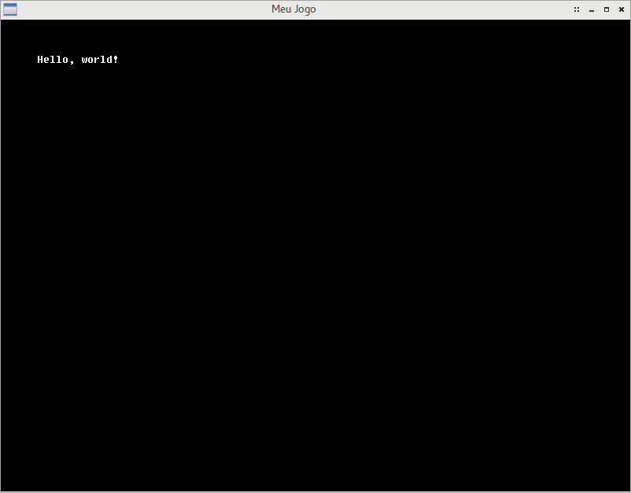

# Escrevendo texto na tela

Para um pequeno teste básico, aprenderemos, agora, a desenhar texto na tela.

Uma fonte de texto é carregada com métodos muito similares a uma textura, como veremos mais adiante. Porém, a Oficina possui algumas fontes de texto já predefinidas para uso imediato.
Neste exemplo, usaremos a fonte Fixedsys Excelsior para escrever texto na tela.

## Carregando e descarregando uma fonte padrão

Vá até o arquivo `src/MinhaCena.hpp`.

Lidaremos, agora, diretamente, com uma estrutura de renderização, então precisaremos do cabeçalho da Oficina onde as estruturas e funções de renderização estão definidas. Abaixo da inclusão do cabeçalho `oficina2/canvas.hpp`, digite o seguinte:

```cpp
#include <oficina2/render.hpp>
```

E logo abaixo da definição da nossa matriz `mvp`, ainda na região `private` da classe, adicione este novo campo:

```cpp
    ofFont fonte;
```

Vá, agora, para o arquivo `src/MinhaCena.cpp`. Você deverá adicionar aos métodos citados estes códigos:

```cpp
// Em "void MinhaCena::load()":
fonte = ofTexturePool::loadDefaultFont(ofFontFaceFixedsysExcelsior);

// Em "void MinhaCena::unload()":
fonte.unload();
```

A explicação para estas linhas é bem intuitiva. No caso do código adicionado a `load`, trata-se do carregamento de uma das fontes predefinidas da Oficina, alteráveis através de uma enumeração; aqui usamos a fonte Fixedsys Excelsior. No caso de `unload`, o código apenas assegura que a fonte seja descarregada da GPU quando nossa cena for descarregada.

É importante notar que a Oficina descarrega toda e qualquer fonte/textura da GPU ao abandonar a aplicação, porém, para evitar uso excessivo de recursos do computador, é aconselhável descarregar tudo o que não for mais usado ao fim de uma cena.

Você pode compilar o projeto para verificar o carregamento da fonte. Caso o carregamento seja feito com sucesso, você verá, no log do console, uma linha escrita da seguinte forma:

```
INFO: ofLoadDefaultFont: Uploaded Fixedsys Excelsior (Hardcoded) to VRAM
```

## Definindo e posicionando um texto

Agora, por fim, desenharemos texto na tela.
Ainda no arquivo `src/MinhaCena.cpp`, vá até o método `void MinhaCena::draw` e adicione o seguinte código:

```cpp
fonte.write("Hello, world!", glm::vec2(50.0f), mvp, glm::vec4(1.0f));
```

O código acima é um método da classe ofFont, que recebe, respectivamente, como parâmetro:

- Um texto a ser exibido (pode ser uma literal ou um texto compatível com uma `std::string`). Infelizmente, atualmente, uma `ofFont` só suporta texto ASCII sem acentuação, exceto pelo acento grave, que também pode ser usado no REPL -- sobretudo em IronScheme;
- A posição do texto (apenas eixos X e Y de coordenadas são suportados). Utilizando abstrações da GL Mathematics, definimos esta posição como 50x50;
- A matriz ModelViewProjection da cena. Teoricamente, você também pode reposicionar o texto usando diretamente essa matriz, especialmente se você tiver um texto sendo renderizado de dentro de uma `ofEntity` (que veremos a seguir), por exemplo. Neste caso, a posição do texto citada anteriormente se tornaria uma posição relativa à posição estipulada na matriz Model;
- Um vetor de quatro dimensões, definindo a COR do texto a ser exibido, em RGBA (vermelho, verde, azul, alpha/transparência) normalizado (valores de 0 a 1). Utilizando abstrações da GL Mathematics, definimos esta cor como branco sólido (R: 1, G: 1, B: 1, A: 1).

Compile e execute o jogo mais uma vez. Você deverá ver texto inserido na tela.



O arquivo `src/MinhaCena.cpp` deverá estar com o seguinte código, agora:

```cpp
#include "MinhaCena.hpp"

void MinhaCena::init()
{
    glm::mat4 view =
        glm::lookAt(
            glm::vec3(0.0f, 0.0f, -1.2f),
            glm::vec3(0.0f, 0.0f, 0.0f),
            glm::vec3(0.0f, -1.0f, 0.0f));
    glm::mat4 projection =
        glm::ortho(
            0.0f,
            800.0f, -600.0f,
            0.0f, 1.0f, 10.0f);
    mvp = projection * view;
}

void MinhaCena::load()
{
    fonte = ofTexturePool::loadDefaultFont(ofFontFaceFixedsysExcelsior);
}

void MinhaCena::unload()
{
    fonte.unload();
}

void MinhaCena::update(float dt)
{
}

void MinhaCena::draw()
{
    fonte.write("Hello, world!", glm::vec2(50.0f), mvp, glm::vec4(1.0f));
}
```
