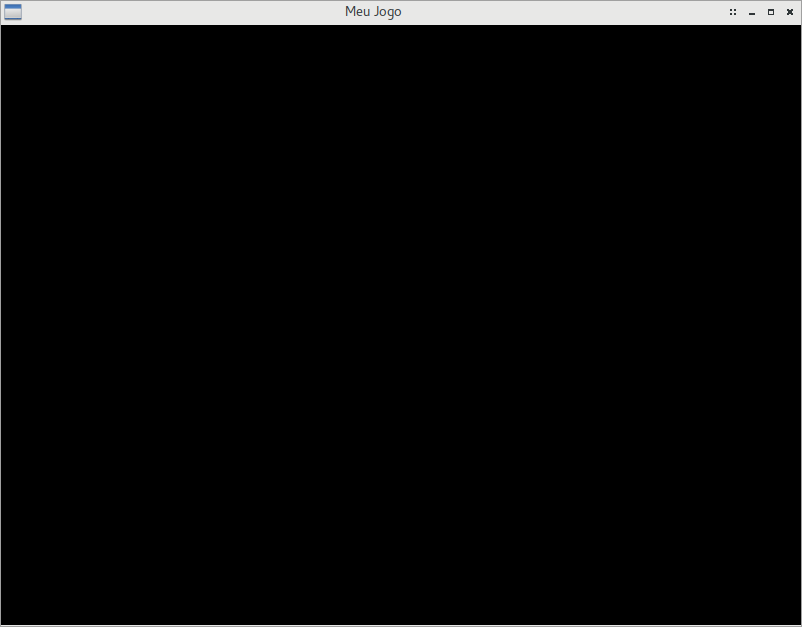

# GameArgs: Pré-configurando seu jogo

Como mencionado anteriormente, a função `ofInit` aceita alguns argumentos interessantes de pré-inicialização do seu jogo. Cobriremos, aqui, alguns deles, que são essenciais e vitais para a qualidade da sua aplicação.

A função `ofInit` aceita, por padrão, nenhum argumento, ou um vetor de strings (`std::vector<std::string>`) contendo configurações iniciais para o seu jogo, como título da janela, localização do ícone da janela em runtime, etc.

Abra o arquivo `src/main.cpp` e, onde se encontra a função `ofInit`, substitua-a por:

```cpp
ofInit({
    "wname=Meu Jogo",
    "datad=MeuJogo",
    "winsz=800x600",
    "frmrt=60c"
});
```

A função, agora, recebe como argumento uma lista de strings separada por vírgula, e envolta em colchetes.

Esta é uma das formas práticas de inicialização de um vetor, e a mais sucinta para se passar o vetor de argumentos de inicialização para esta função.

É importante ressaltar que as strings devem ser cuidadosamente separadas por vírgulas, uma vez que, por padrão, C++ concatenará duas strings que não estejam separadas por algum separador padrão da linguagem (como vírgulas ou ponto-e-vírgulas).

Estes argumentos, referidos na documentação da Oficina como GameArgs, são argumentos de inicialização padrão para o seu jogo. Cada argumento é uma string de exatamente cinco caracteres, seguidos de um caractere `=`, e dos argumentos que cada GameArg espera. Os GameArgs aqui usados são:

- `wname`: Define um nome da janela. Pode incluir espaços;
- `datad`: Define o nome da pasta de dados do jogo. Uma pasta de dados do jogo é aquela que possui texturas e scripts de um jogo. Por padrão, o jogo primeiramente procura por seus recursos na atual pasta de execução do programa. Se não encontra, procura nas pastas onde o sistema operacional normalmente armazena dados de aplicativos. No Linux, estas pastas são `/usr/share/<nome da pasta>`, `/usr/local/share/<nome da pasta>` e `/home/<usuário>/.local/share/<nome da pasta>`; no Windows, são `C:\Arquivos de Programas\<nome da pasta>` ou `C:\Arquivos de Programas (x86)\<nome da pasta>`, dependendo da versão e arquitetura do seu sistema operacional. No nosso caso, nossos arquivos de recursos estarão em `res`, que deverá ser instalada, quando o jogo for publicado, em uma destas pastas, sob o subdiretório `<nome da pasta>/res` ou, mais precisamente, `MeuJogo/res`.
- `winsz`: Define um tamanho em pixels para a janela do aplicativo. Neste caso, a janela terá um tamanho de 800x600 e estará centralizada no monitor principal.
- `frmrt`: Define a configuração de quadros por segundo (FPS) da aplicação. Aqui, forçamos nossa aplicação (`c`, de "capped"/limitado) a um máximo de 60 quadros por segundo; ao ultrapassar esse valor, o jogo força um delay na aplicação até o próximo segundo.

Para mais informações de GameArgs e outros valores/literais que podem ser usados nos GameArgs apresentados, consulte a documentação da OficinaFramework.

Após está alteração, volte à pasta raiz do seu jogo, e compile-o novamente. Você deve ver uma nova janela preta, porém desta vez menor, e com outro título:



